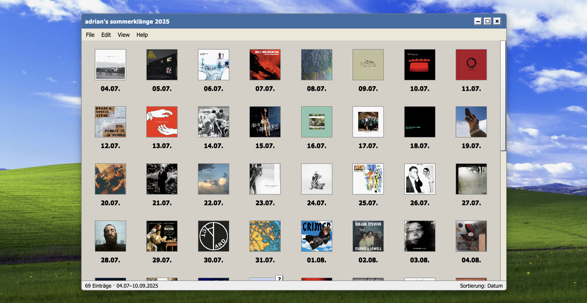

# 🎵 summeralbum25 – Adrians Sommerklänge 2025

**summeralbum25** ist ein interaktives, im **Windows XP Look** gestaltetes Musik-Tagebuch.  
Es zeigt alle Alben, die ich zwischen **04.07.2025 und 10.09.2025** gehört habe, in Form von pixeligen Album-Covern mit Datum-Icons und XP-typischen Fenstern.



---

## ✨ Features

- **Windows XP UI**  
  - Startmenü-ähnliche Menüleiste (`File`, `Edit`, `View`, `Help`)
  - Draggable & resizable Fenster mit Titelbar, Buttons und Statusleiste  
- **Album-Tagebuch**  
  - 70+ Alben, täglich ein Eintrag  
  - Lazy-Loading der Cover (iTunes API → MusicBrainz Fallback)
  - Pixel-Look (`image-rendering: pixelated`) + Retro-Style Grid  
- **Interaktive Funktionen**
  - Mehrere Fenster parallel öffnen
  - Sortieren & Filtern nach Datum, Artist, Genre, Rating …
  - Random-Album öffnen (XP-Easter-Egg 😉)

---

## 🛠️ Tech-Stack

- **[SvelteKit](https://kit.svelte.dev/)** (SSG / static export)
- **Vite** (Dev-Server & Build)
- **Interact.js** (Drag & Resize)
- **iTunes Search API** + **MusicBrainz** (Cover-Fetching)
- **CSS-Only XP Theme** (kein UI-Framework)

---

## 🚀 Lokale Entwicklung

```bash
git clone https://github.com/adrianjanka/summeralbum25.git
cd summeralbum25
npm install
npm run dev